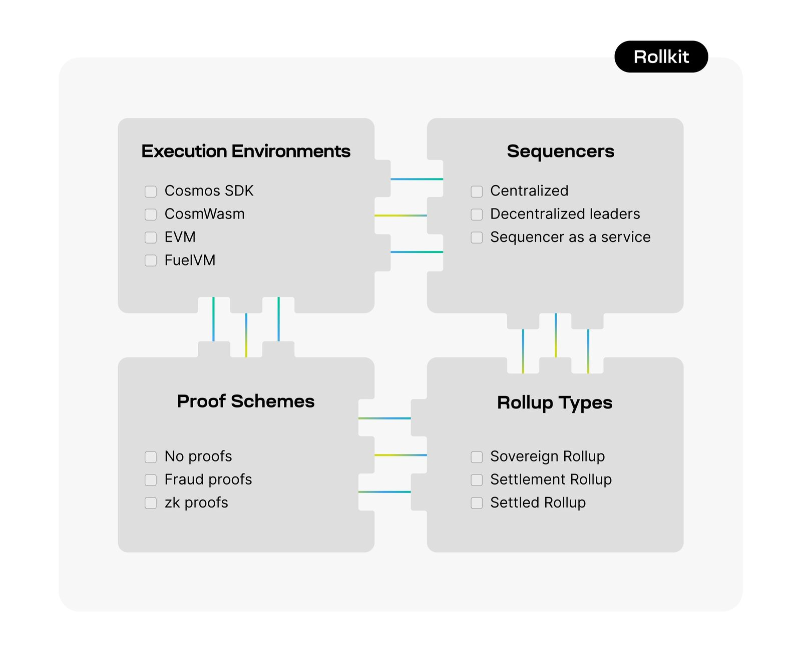

_The original version of this blog post can be found on the [Celestia blog](https://blog.celestia.org/introducing-rollkit-a-modular-rollup-framework/)._

Today, we’re pleased to introduce Rollkit, previously known as Rollmint. Rollkit is a modular rollup framework that gives developers the freedom to deploy rollups throughout the modular stack, opening new possibilities for rapid experimentation and innovation.

Rollkit provides a modular node for running rollups on top of a data availability layer. It exposes an ABCI-compatible client interface that can be used as a replacement for Tendermint for any [ABCI](https://github.com/informalsystems/tendermint/tree/main/abci)-compatible blockchain app, including Cosmos chains.

In development since 2021, Rollkit is now emerging as neutral and independent from the Celestia blockchain. Rollkit will serve as a community-led public good for the modular ecosystem going forward, with its own docs site at [rollkit.dev](/).

## Tl;dr:

- You can now [build with Rollkit](/) on Celestia’s Mocha testnet. Check out the [docs](/)
- You can customize rollups and plug-in arbitrary data availability and execution layers by leveraging Rollkit’s modular framework
- Join our Rollkit developer calls that begin in April to help guide its development

## Deploying a new chain is hard

Deploying your decentralized application as a smart contract on a shared blockchain means it will share computational resources and is restricted to that blockchain's execution environment. This limits your application's scalability and flexibility.

For that reason, many developers have turned to launching their own layer 1 chains using tools like Tendermint and the Cosmos SDK. However, deploying a new layer 1 chain presents its own set of complex challenges and trade-offs.

In order to deploy a new layer 1 chain, a developer must gather a set of validators to secure the chain, issue a token to compensate these validators, and continuously maintain the network infrastructure. This represents a huge cost in social coordination, time, capital and expertise. This cost prevents many developers from launching their own chains and innovation from progressing as quickly as it could.

## Freedom to deploy

Rollups are the answer to this problem. Rollups provide similar advantages as a layer 1 blockchain but reduce the overhead of deploying and maintaining your own chain.

Rollups provide similar benefits to blockchain developers that cloud infrastructure provides for traditional web developers. Deploying a new layer 1 blockchain is like maintaining a physical server, slow and expensive. Rollups remove the need for blockchain developers to launch and maintain their own layer 1s to deploy their own chain.

With Rollkit, developers no longer have to worry about the complex challenges of deploying a new blockchain. Rollkit will do for rollup chains what Tendermint did for layer 1 chains. The way it works is that rollups leverage an underlying layer for consensus, so that developers don’t need to build their own consensus networks. Rollkit rollups inherit security from the data availability layer, eliminating the need for a full set of validators and reducing the technical barrier for developers.

## Vision for Rollkit

In the spirit of modularity, Rollkit’s long-term vision is to give developers a variety of options to choose from so that they can easily plug-in, switch or replace features in Rollkit.

In a rapidly evolving industry like blockchain, time to market and the ability to rapidly experiment and innovate are critical. Rollkit’s customizable stack will enable developers to bring their products to market faster and with more flexibility.

### Execution environments

Rollkit will allow you to easily swap in different execution environments. Not fond of the Cosmos SDK? Try Rust with CosmWasm. Still like Solidity? Plug in the EVM. None of the options suit your needs? Modify or add your own execution environment without needing to rebuild your entire chain from scratch.

### Sequencers

Rollkit will support multiple sequencing modes to suit your specific use case. A single sequencer might be all you need. If your application requires stronger liveness, you can opt for multiple sequencers using your own set or leverage a set of shared sequencers.

### Proof schemes

Rollkit will support a multitude of proof schemes to ensure the execution of your rollup. Run your application in zk mode, optimistic mode with fraud proofs, or pessimistic mode without any proofs.

### Rollup types

Rollkit will allow you to build a diverse range of rollups, including sovereign rollups, settlement rollups and settled rollups.

Rollkit is in an early stage of development and many features remain to be built to reach this vision. In its [current state](/docs/rollkit-stack), Rollkit rollups are [sovereign rollups](https://blog.celestia.org/sovereign-rollup-chains) with single sequencers, with support for a pessimistic mode and a [work-in-progress optimistic mode](https://github.com/rollkit/rollkit/blob/manav/state_fraud_proofs_adr/docs/lazy-adr/adr-009-state-fraud-proofs.md). [Integration tutorials](/docs/category/tutorials) are ready and available with Cosmos SDK, Ethermint, and CosmWasm.

We invite the community to collaborate with us to build new features. Each new team that joins the growing Rollkit community brings more firepower to ship new features that we all benefit from. This is the power of modularity in action. 

## Rollkit is neutral

Celestia Labs originally started developing Rollkit in 2021, when the modular ecosystem was nascent and general-purpose rollup software did not exist. We started building Rollkit out of necessity, because having general-purpose software for rollup chains was critical to the Celestia mission of making deploying a new chain as easy as deploying a smart contract.

Since 2021 several projects have also started building general-purpose execution layer rollup software for various use cases. This includes [Eclipse](https://twitter.com/EclipseFND) (Solana VM rollups), [Dymension](https://twitter.com/dymensionXYZ) (settled Cosmos rollups), [Sovereign Labs](https://twitter.com/sovereign_labs) (sovereign ZK rollups), and [Optimism](https://twitter.com/optimismFND) (EVM rollups).

To ensure Celestia remains a decentralized and credibly neutral data availability layer that treats all rollup software as first class citizens, we decided to spin out Rollkit from Celestia Labs into its own project with its own GitHub org and docs site.

This also means that Rollkit aims to be neutral to the underlying data availability layer. Rollkit is designed to allow developers to integrate other data availability layers besides Celestia via the [data availability interface](https://github.com/rollkit/rollkit/blob/567b9f500db8055289365ea63450cefe4b135077/da/da.go#L60).

The Celestia Labs Execution Environments team is currently contributing to the initial and necessary components of Rollkit, and is calling for all developers to contribute to it.

Spinning out Rollkit will enable both Celestia and Rollkit to serve the entire modular ecosystem as public goods that are neutral and independent from each other, and not favor each other in the modular stack.

We believe that to create a positive-sum crypto ecosystem where modularism thrives over maximalism, it’s important that developers have access to neutral rollup frameworks that are treated as public goods. In order for crypto to move into mainstream adoption, the industry needs to work together to create foundational developer tooling that will help crypto to level up.

## Next steps

Moving towards a community-led project means increased visibility, transparency and inclusivity. That’s why the Rollkit team will soon release a roadmap blog post to detail ongoing work and its purpose. The team will also hold regular public calls with community members to showcase recent developments, discuss the roadmap and gather feedback from developers building with Rollkit. Keep an eye out for a new announcement from Rollkit. 

Learn more about how Rollkit works [on the new Rollkit website](/) (you're already on it!). And don’t forget to check out the [Rollkit repo](https://github.com/rollkit) too.

Let’s build modular together.
