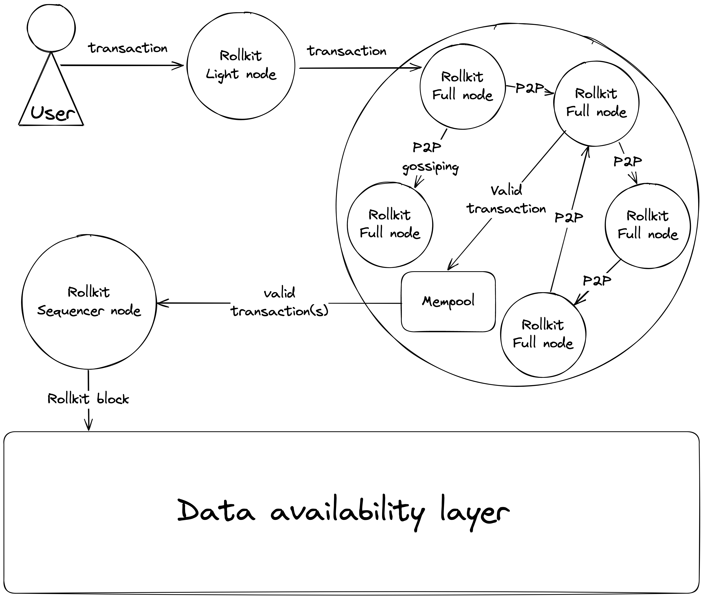

# Transaction Flow

Rollup users use a light node to communicate with the rollup P2P network for two primary reasons:

- to submit transactions
- to gossip headers
- to gossip fraud proofs

:::caution note
Light nodes are still a work in progress.
:::

Here's what the typical transaction flow looks like:

To transact, users submit a transaction to their light node, which gossips the transaction to a full node. Before adding the transaction to their mempool, the full node checks its validity. Valid transactions are included in the mempool, while invalid ones are refused, and the user's transaction will not be processed.

If the transaction is valid and has been included in the mempool, the sequencer can add it to a rollup block, which is then submitted to the data availability (DA) layer. This results in a successful transaction flow for the user, and the state of the rollup is updated accordingly.

After the block is submitted to the DA layer, the full nodes download and validate the block.
However, there is a possibility that the sequencer may alter the state after a user's transaction and submit an invalid block to the DA layer, either by mistake or maliciously. In such cases, the full nodes of the rollup chain will consider the block invalid. If they find the block invalid, they generate fraud proofs and gossip them in the P2P network among other full and light nodes.

As a result, the rollup chain will halt, and the network will decide to fork the chain through social consensus. In the future, when a decentralized sequencer scheme is in place, additional options will be available, such as slashing the sequencer or selecting another full node as the sequencer. However, in any case, a new block must be created and submitted to the DA layer. You can read more about sequencer nodes [here](./rollkit-stack.md#sequencer-node).
