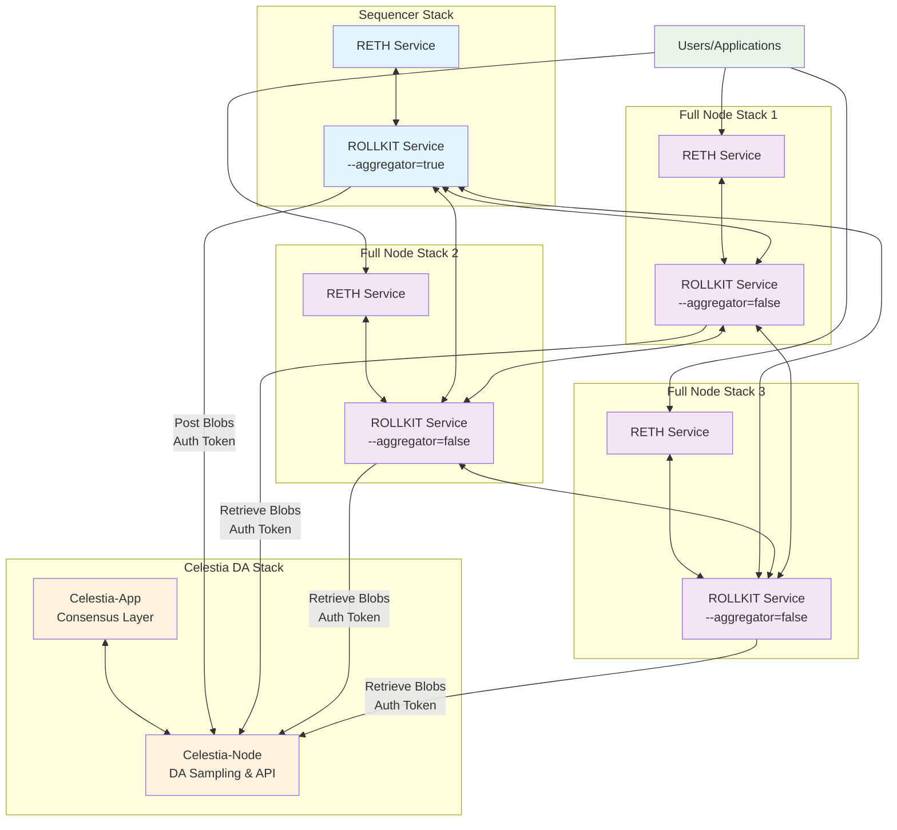

# 🚀 Rollkit EVM Deployment Guide

This tutorial is going to show you how to deploy a Rollkit testnet, focusing on the architecture choices and components that make up a complete EVM-based chain deployment.

You can learn more about Rollkit EVM architecture [here](/learn/execution.md).

<!-- markdownlint-disable MD033 -->

:::tip
<Callout />
:::
<!-- markdownlint-enable MD033 -->

## 🏗️ Architecture Overview

The following diagram illustrates the complete deployment architecture with component interactions:

**Key Interactions:**
- **Engine API**: RETH ↔ ROLLKIT communication within each stack
- **P2P Network**: ROLLKIT nodes sync blocks and share chain state
- **Data Availability**: Sequencer posts blobs, full nodes retrieve blobs from Celestia
- **User Access**: Applications connect to full node RETH services for JSON-RPC access

## 💻 Pre-requisites {#prerequisites}

Make sure you understand the sequencing topology you want to use by reading the [Sequencing Overview](/learn/sequencing/overview.md).

## 🛠️ Dependencies {#dependencies}

### 🔄 Choosing Your Sequencing Topology {#choosing-sequencing-topology}

First, you need to choose a sequencing topology for your Rollkit EVM chain. The sequencing topology determines how transactions are ordered and blocks are produced in your chain.

Currently, Rollkit supports one sequencing implementation:

### 🔄 Single Sequencer
- **Description**: The simplest sequencing architecture where one node is responsible for ordering transactions and producing blocks
- **Use Cases**: Development, testing, and production deployments requiring simplicity and low latency
- **Advantages**: Easy setup, fast block production, independence from DA block time
- **Requirements**: One sequencer node, multiple optional full nodes

For detailed information about sequencing topologies, see the [Sequencing Overview](/learn/sequencing/overview.md) and [Single Sequencer](/learn/sequencing/single.md) documentation.

## 🏗️ Deployment Architecture {#deployment-architecture}

### 🔄 Single Sequencer Topology

In a single sequencer deployment, you will run:

1. **One Sequencer Node** (Required)
   - Handles transaction ordering and block production
   - Posts data to the Data Availability layer
   - Serves as the primary source of truth for the chain

2. **Multiple Full Nodes** (Optional, but recommended)
   - Sync blocks from the sequencer
   - Provide redundancy and decentralization
   - Can serve user queries and transactions
   - Scale horizontally based on demand

## 🛠️ Setting up your environment {#setting-up-your-environment}

In addition to choosing your sequencing topology, we need to understand the components that make up your deployment.

We will use a combination of RETH and ROLLKIT services for this tutorial and run them together to create your EVM chain.

Each node in your Rollkit EVM deployment (whether sequencer or full node) consists of two primary services working together:

### ⚡ RETH Service
- **Purpose**: Provides the Ethereum Virtual Machine (EVM) execution environment
- **Technology**: Rust-based Ethereum client (Reth) that handles transaction execution
- **Responsibilities**:
  - Processing EVM transactions
  - Maintaining the EVM state
  - Providing Ethereum JSON-RPC API endpoints
  - Managing the execution layer consensus

### 🔗 ROLLKIT Service
- **Purpose**: Handles chain-specific functionality and consensus
- **Technology**: Rollkit node implementation
- **Responsibilities**:
  - Block production and validation
  - Data availability integration
  - P2P networking between chain nodes
  - Chain consensus mechanisms
  - Communication with the execution layer (RETH)

### 🔄 Service Interaction

The two services work together through well-defined interfaces:

1. **Engine API**: Rollkit communicates with RETH using the Engine API (typically on port 8551)
2. **JWT Authentication**: Secure communication between services using shared JWT secrets
3. **Block Coordination**: Rollkit orchestrates block production while RETH executes transactions

## ⚙️ Node Configurations {#node-configurations}

### 🎯 Sequencer Node Configuration
The single sequencer node runs both RETH and ROLLKIT services with specific settings:
- **RETH**: Configured to accept blocks from the Rollkit sequencer
- **ROLLKIT**: Configured with `--rollkit.node.aggregator=true` to enable block production
- **Role**: Produces blocks, orders transactions, posts to DA layer

### 📡 Full Node Configuration
Each full node also runs both RETH and ROLLKIT services but in sync mode:
- **RETH**: Configured to process blocks received from the network
- **ROLLKIT**: Configured with `--rollkit.node.aggregator=false` to sync from the sequencer
- **Role**: Syncs blocks, serves queries, provides redundancy

### 🔑 Key Integration Points

All nodes require:
- Shared JWT secret for Engine API authentication
- Matching genesis configuration between ROLLKIT nodes
- Proper network configuration for service communication
- Coordinated startup sequence (typically RETH first, then ROLLKIT)

### ⏰ Block Time Configuration

You can customize timing parameters for your chain. While there are many configuration arguments available for the Rollkit binary, two important timing-related flags are:

#### 🎯 Sequencer Block Time
- **Flag**: `--rollkit.node.block_time`
- **Default**: 1s (1 block per second)
- **Purpose**: Controls how frequently the sequencer produces new blocks
- **Customization**: Can be adjusted based on throughput requirements and latency preferences

#### 📊 Data Availability Block Time
- **Flag**: `--rollkit.da.block_time`
- **Default**: 6s
- **Purpose**: Controls how frequently blobs are posted to the Celestia chain
- **Function**: Each 6 seconds (by default), batched block data is submitted to Celestia for data availability

## 🌌 Data Availability Layer: Celestia {#celestia-da}

Your Rollkit EVM chain connects to Celestia as the Data Availability (DA) layer. The Rollkit EVM Celestia DA stack consists of two key services:

### 🏛️ Celestia-App Service
- **Purpose**: Provides the consensus layer for the Celestia network
- **Responsibilities**:
  - Processing and ordering transactions on the Celestia network
  - Maintaining the canonical state of the DA layer
  - Participating in Tendermint consensus

### 🌐 Celestia-Node Service
- **Purpose**: Provides data availability sampling and networking
- **Responsibilities**:
  - Data availability sampling (DAS) to verify data availability
  - P2P networking for block and data propagation
  - Light client functionality for resource-constrained environments
  - API endpoints for chains to submit and retrieve data

### 🔗 Celestia Integration

Both sequencer and full node Rollkit services need to communicate with the celestia-node service, but for different purposes:

#### 📤 Sequencer Node Communication
- **Purpose**: Batch posting of block data (blobs) to Celestia
- **Operation**: The sequencer Rollkit service submits batched block data to Celestia via the celestia-node API
- **Frequency**: Occurs regularly as new blocks are produced and need to be made available

#### 📥 Full Node Communication
- **Purpose**: Retrieving block data (blobs) from Celestia
- **Operation**: Full node Rollkit services query and download historical block data via the celestia-node API
- **Frequency**: Occurs during initial sync and ongoing block validation

#### 🔑 Common Integration Points
1. **Authentication**: Rollkit requires an auth token generated by the celestia-node so that Rollkit can send transactions on its behalf. Both sequencer and full node types use these JWT tokens for secure communication with celestia-node
2. **Namespace Isolation**: Data is organized using Celestia namespaces
3. **API Endpoints**: Both sequencer and full nodes use the same celestia-node API interface
4. **Network Configuration**: All nodes must be configured to connect to the same Celestia network

### 🛠️ Deployment Considerations

When deploying with Celestia DA:
- **Light Node**: Most chains run a celestia-node in light mode for cost efficiency
- **Network Selection**: Choose between Arabica (devnet), Mocha (testnet), or Mainnet Beta
- **Funding**: Ensure your celestia-node wallet has sufficient TIA tokens for data submission

We now have all we need to understand the components for deploying a Rollkit EVM chain.

### 🚀 Run your Rollkit EVM chain {#run-rollkit-evm-chain}

A complete Rollkit EVM chain deployment consists of:

1. **One Sequencer Node**: RETH + ROLLKIT (aggregator mode)
2. **N Full Nodes**: RETH + ROLLKIT (sync mode) - scale as needed
3. **Celestia Connection**: celestia-node service for data availability

You can deploy your chain by running the sequencer and full nodes with the proper configuration.

Congratulations! You have successfully understood how to deploy a Rollkit EVM chain.

## 🐳 Simplified Deployment with Docker Compose {#docker-compose-deployment}

The deployment of sequencer and full nodes requires running multiple processes and providing specific variables so they can effectively interact with each other. Managing these configurations manually can be complex and error-prone, especially when coordinating JWT secrets, genesis configurations, network settings, and service dependencies across multiple node stacks.

To save time, we can use ready-to-use Docker Compose stacks that can be customized based on specific needs. These pre-configured stacks handle the complexity of service orchestration, environment variable management, and inter-service communication automatically.

To make this deployment process easy and painless for node operators, you can use the example implementation available at: [https://github.com/rollkit/ops-toolbox/tree/main/ev-stacks](https://github.com/rollkit/ops-toolbox/tree/main/ev-stacks/)

This solution provides:
- Pre-configured Docker Compose files for sequencer and full node deployments
- Automated handling of JWT secrets and genesis file distribution
- Simplified configuration through environment variables
- Easy scaling of full node instances
- Integrated Celestia node configuration

:::warning
This deployment approach is suitable for testnets and development environments, but is not suitable for production-grade mainnet deployments, which require additional security considerations, monitoring, backup strategies, and infrastructure hardening.
:::

## 🎉 Next steps

Congratulations again! You now know how to deploy Rollkit EVM chains and understand the architecture and components needed.

For detailed setup instructions, see:
- [Single Sequencer Setup Guide](/guides/evm/single.md) - Step-by-step deployment instructions
- [RETH Backup Guide](/guides/evm/reth-backup.md) - Data protection and backup procedures
- [Celestia DA Guide](/guides/da/celestia-da.md) - Connecting to Celestia networks

You can also learn more about local deployments in our [Docker Compose guide](/guides/deploy/local.md).
