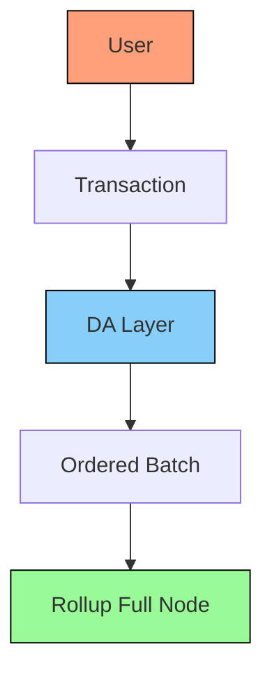

# Basic Rollup

## Description

The simplest way to build a Rollup. You delegate Aggregation to the DA-Layer. Every Rollup node has to replay all the transactions in the rollup in order to check and update to the newest state.

## Design

Here is an example of what this design could look like:

## Aggregation

The DA-Layer is the Aggregator. It does Inclusion and Ordering.

## Header Production

Each Full Node has to execute all transactions. There are no Light Nodes in this system so there is no need to produce a rollup header.

## Censorship Resistance

Based rollups enjoy the same censorship resistance as the DA-Layer.

## Liveness

Based rollups enjoys the same liveness guarantees as the DA-Layer (Based Rollups).

## Rollup Light Nodes

This design has no Rollup Light Nodes.

## Smallest Trust-Minimized Setup

DA-Layer Light Node + Rollup Full Node
