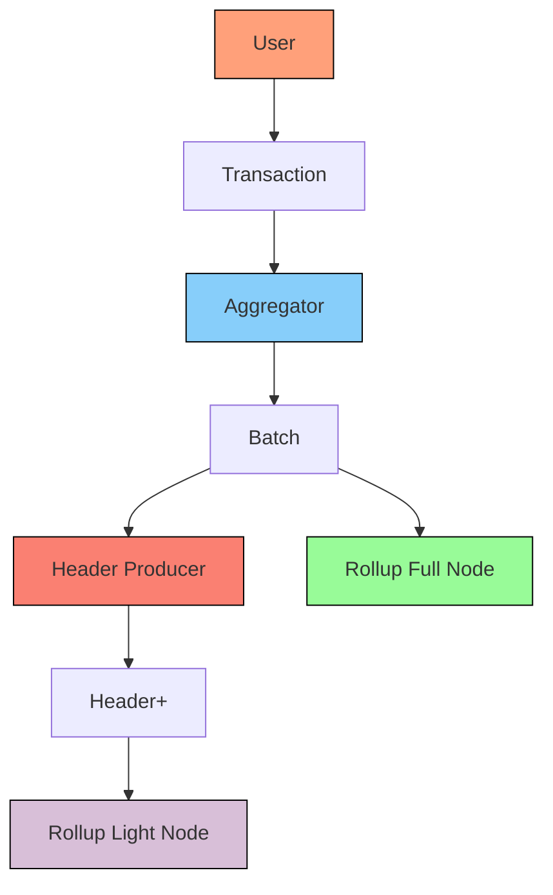

# Basic Rollup

## Description

The User submits a transaction to the Aggregator. After Aggregation, the Rollup Full Node can use the Batch and apply the changes to the state.

During the Header Production, the Header is generated with some security grantees. The Rollup Light Node can consume the Header and validate those security guarantees.

## Diagram

Here is an example of what this design could look like:

## Aggregation

TBD

## Header Production

TBD

## Censorship Resistance

TBD

## Liveness

TBD

## Rollup Light Nodes

TBD

## Smallest Trust-Minimized Setup

TBD
