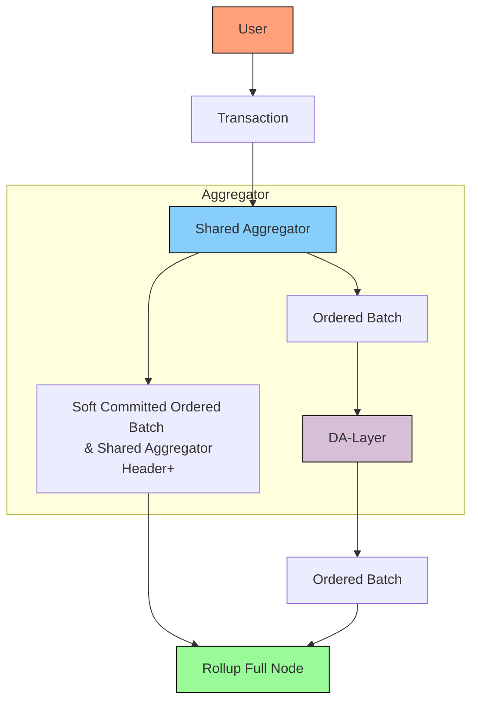

# Pessimistic Rollup with a Shared Sequencer

## Description

This is a pessimistic Rollup using a Shared Sequencer. This design follows the Forum Post originating the [Shared Sequencer Design](https://forum.celestia.org/t/sharing-a-sequencer-set-by-separating-execution-from-aggregation/702/9). We assume the only canonical way to order the transactions are through the Shared Sequencer. All transactions have to be ordered by the Shared Sequencer and other batches are ignored.

## Design

Here is an example of what this design could look like:

## Aggregation

The Shared Sequencer Aggregates Transactions and posts the ordered Batch to the underlying DA-Layer.

> To unlock a web2 equivalent UX, the shared sequencers […] can provide fast soft commitments. These soft commitments provide some arbitrary promise of the final ordering of transactions, and can be used to create prematurely updated versions of the state. As soon as the block data has been confirmed to be posted on the base layer, the state can be considered final.
>

The Shared Sequencer does Inclusion and Ordering.

## Header Production

Each Full Node has to execute all transactions. There are no Light Nodes in this system so there is no need to produce a rollup header.

## Censorship Resistance

Lets assume $L_{ss}$ is the liveness of the Shared Sequencer and the $L_{da}$ is the liveness of the DA-Layer. Then the liveness of this scheme is $L = Min[L_{ss},L_{da}]$ saying if one of the Systems has a liveness failure the Rollup has a liveness failure. If the Shared Sequencer fails then we cannot proceed with the Rollup. If the DA-Layer fails we could continue with the Shared Sequencers Soft Commitments. We would inherit the consensuses and data-availability from the Shared Sequencer which would be worse than the original Data-Availability Layer.

## Liveness

Based rollups enjoys the same liveness guarantees as the DA-Layer (Based Rollups).

## Rollup Light Nodes

N/A

## Smallest Trust-Minimized Setup

DA-Layer Light Node + Shared Sequencer Light Node +  Rollup Full Node

We need a Shared Sequencer Light Node to validate the Headers of the Shared Sequencer. We made an assumption in the beginning that the order is fixed by the ordering of the shared sequencer. The Shared Sequencer will have a cryptographic commitment of the order of the Transaction inside the Shared Sequencer Header. This way we can confirm that the batch that we receive or read from the DA-Layer is the one created by the Shared Sequencer.
