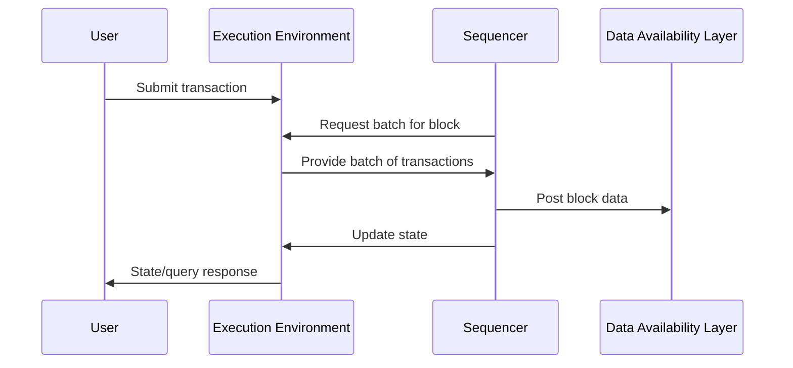

# Single Sequencer

A single sequencer is the simplest sequencing architecture for a Rollkit-based rollup. In this model, one node (the sequencer) is responsible for ordering transactions, producing blocks, and submitting data to the data availability (DA) layer.

## How the Single Sequencer Model Works

1. **Transaction Submission:**
   - Users submit transactions to the execution environment via RPC or other interfaces.
2. **Transaction Collection and Ordering:**
   - The execution environment collects incoming transactions.
   - The sequencer requests a batch of transactions from the execution environment to be included in the next block.
3. **Block Production:**
   - **Without lazy mode:** the sequencer produces new blocks at fixed intervals.
   - **With lazy mode:** the sequencer produces a block once either  
     - enough transactions are collected  
     - the lazy-mode block interval elapses
    More info [here](/learn/config#lazy-mode).
   - Each block contains a batch of ordered transactions and metadata.

4. **Data Availability Posting:**
   - The sequencer posts the block data to the configured DA layer (e.g., Celestia).
   - This ensures that anyone can access the data needed to reconstruct the rollup state.

5. **State Update:**
   - The sequencer updates the rollup state based on the new block and makes the updated state available to light clients and full nodes.

## Transaction Flow Diagram

## Advantages

- **Simplicity:** Easy to set up and operate, making it ideal for development, testing, and small-scale deployments compared to other more complex sequencers.
- **Low Latency:** Fast block production and transaction inclusion, since there is no consensus overhead among multiple sequencers.
- **Independence from DA block time:** The sequencer can produce blocks on its own schedule, without being tied to the block time of the DA layer, enabling more flexible transaction processing than DA-timed sequencers.

