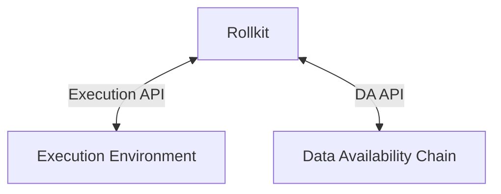

# Rollkit stack

This page will cover the main components of Rollkit.

Sequencer nodes collect transactions from users, aggregate them into blocks, and post the blocks onto a data availability (DA) layer (such as Celestia) to be ordered and finalized. Full nodes execute and verify blocks, and in the case of an optimistic system, propagate fraud proofs when needed. Light clients will receive headers, verify proofs (fraud, zk, etc), and authenticate trust-minimized queries about the state.

## Application structure



### Execution API

Rollkit's execution API is simple and allows developers to bring their own execution environments instead of using provided ones. The execution API allows the execution environment to do ordering and more intillgently process transcations than what a generalized library could.

#### Cosmos SDK

Would you like to change your Cosmos SDK application to a Rollkit chain?
No problem! All you need to do is use the start function we provide in the ABCI Folder, [see here on what changes are needed](TODO)

### Data availability

[Data availability (DA)](https://github.com/rollkit/rollkit/tree/main/da) can be accessed using generic [interfaces](https://github.com/rollkit/rollkit/blob/main/core/da/da.go).

The `BlockRetriever` interface serves to enable syncing of full nodes from the data availability layer.
It's important to keep in mind that there is no direct correlation between the DA layer block height and the chain height. Each DA layer block may contain an arbitrary number of blocks.

#### Celestia

Celestia is a prominent example of a data availability integration implemented for Rollkit.
It's using the [Celestia Node API](https://node-rpc-docs.celestia.org)
via the [`rollkit/da`](https://github.com/rollkit/rollkit/tree/main/da) package.
To deploy a Rollkit chain on Celestia you also have to [run a Celestia light node](https://docs.celestia.org/how-to-guides/celestia-node).

## Node components

### Block manager

The [block manager](https://github.com/rollkit/rollkit/tree/main/block) contains routines `AggregationLoop`, `RetrieveLoop`, and `SyncLoop` that communicate through Go channels. These Go routines are run when a Rollkit node starts up (`OnStart`). Only the sequencer nodes run `AggregationLoop` which controls the frequency of block production for a chain with a timer as per the `BlockTime` in `BlockManager`.

All nodes run `SyncLoop` which looks for the following operations:

- **Receive block headers**: block headers are received through a channel `HeaderInCh` and Rollkit nodes attempt to verify the block with the corresponding block data.
- **Receive block data**: block bodies are received through a channel `blockInCh` and Rollkit nodes attempt to verify the block.
<!-- - **Receive state fraud proofs**: state fraud proofs are received through a channel `FraudProofInCh` and Rollkit nodes attempt to verify them. Note that we plan to make this configurable for full nodes since full nodes also produce state fraud proofs on their own. -->
- Signal `RetrieveLoop` with timer as per the `DABlockTime` in `BlockManager`.

All nodes also run `RetrieveLoop` which is responsible for interacting with the data availability layer. It checks the last updated `DAHeight` to retrieve a block with timer `DABlockTime` signaled by `SyncLoop`. Note that the start height of the DA layer for the chain, `DAStartHeight`, is configurable in `BlockManager`.

### Comet RPC

Rollkit's ABCI [RPC](https://github.com/rollkit/go-execution-abci/tree/main/pkg/rpc) implements the [CometBFT RPC](https://docs.cometbft.com/v0.37/spec/rpc/) interfaces and APIs for querying:

- **Information about the node**: information such as node's health, status, and network info.
- **The blockchain**: getting information about the blockchain such as blocks and block headers.
- **The transactions**: getting transaction information and broadcasting raw transactions, with search capabilities.
- **ABCI**: application information.

The following RPC protocols are currently supported:

- URI over HTTP
- JSON-RPC over HTTP
- JSON-RPC over WebSockets

The RPC provides an additional query for DA included blocks using the `height` parameter:

```sh
curl http://127.0.0.1:26657/block?height=1

curl http://127.0.0.1:26657/block?height=included
```

#### Parameters

- height (integer or string): height of the requested block. If no height is specified the latest block will be used. If height is set to the string "included", the latest DA included block will be returned.

### P2P layer

Rollkit's [P2P layer](https://github.com/rollkit/rollkit/tree/main/p2p) enables
direct communication between nodes.
It's used to gossip transactions, headers of newly created blocks, and state fraud proofs.
The P2P layer is implemented using [libp2p](https://github.com/libp2p).

Rollkit uses [DHT-based active peer discovery](https://curriculum.pl-launchpad.io/curriculum/libp2p/dht/).
Starting a node connects to pre-configured bootstrap peers, and advertises its namespace ID in the DHT.
This solution is flexible, because multiple networks may reuse the same DHT/bootstrap nodes,
but specific network might decide to use dedicated nodes as well.

## Rollkit node types

Rollkit nodes are implemented in the [`node`](https://github.com/rollkit/rollkit/tree/main/node) package.

### Full node

Full nodes verify all blocks, and produce fraud proofs for optimistic systems. Since they fully verify all blocks, they don't rely on fraud or validity proofs for security.

### Sequencer node

Sequencer nodes can be utilized. Sequencers are block producers, responsible for aggregating transactions into blocks, and typically executing transactions to produce a state root, used by the light clients.

Rollkit plans to support multiple different pluggable sequencer schemes:

|                       |       Deploy in one-click        | Faster soft-confirmations than L1 | Control over transaction ordering | Atomic composability with other chains | Censorship resistance | Implementation Status |
|:---------------------:|:--------------------------------:|:---------------------------------:|:------------------------------------------:|:---------------------------------------:|:---------------------:|:---------------------:|
|   Single sequencer    | Requires spinning up a sequencer |               Yes ✅               |                   Yes ✅                    |                  No ❌                   |      Eventual ⏳*      |    ✅ Implemented!     |
|    Based sequencer    |  Requires spinning up a gateway  |               No ❌                |                   Yes ✅                    |                  No ❌                   |        Yes  ✅         |        Planned        |

## State validity modes

### Pessimistic (full nodes only)

A pessimistic system is one that only supports full nodes that replay all the transactions in the system in order to check its validity. Rollkit supports pessimistic operation by default.

This pessimistic mode of operation is similar to how Tether uses Bitcoin as a data availability layer via [OmniLayer](https://github.com/OmniLayer/spec/blob/master/OmniSpecification-v0.6.adoc#summary).
