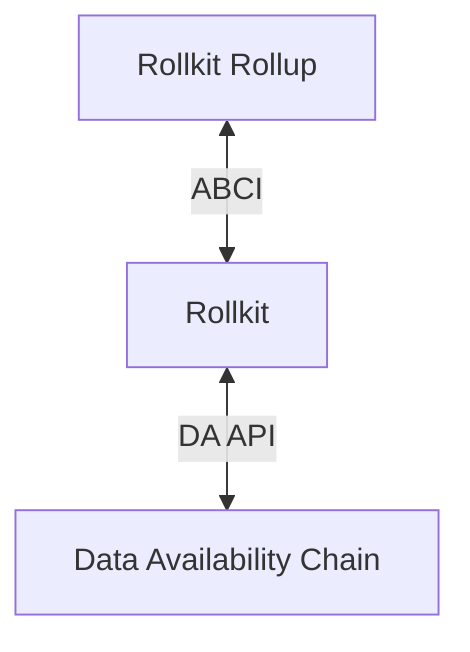

# Rollkit stack

This page will cover the main components of Rollkit.

Rollup sequencer nodes collect transactions from users, aggregate them into blocks, and post the blocks onto a data availability (DA) layer (such as Celestia) to be ordered and finalized. Full nodes execute and verify rollup blocks, and in the case of an optimistic rollup, propagate fraud proofs when needed. Light clients will receive headers, verify proofs (fraud, zk, etc), and authenticate trust-minimized queries about the state.

## Application structure

### ABCI interface

Rollkit is a fully functional Application BlockChain Interface (ABCI) client software. It can be used as a CometBFT replacement for any ABCI application.
Thanks to this compatibility, you can use tools like [abci-cli](https://docs.cometbft.com/v0.37/app-dev/abci-cli) to test and debug your rollup.

#### Cosmos SDK

Would you like to change your Cosmos SDK application to a Rollkit rollup?
No problem! You need to replace the Cosmos SDK Go dependency with a
Rollkit-enabled version, which can be found
at the [`rollkit/cosmos-sdk`](https://github.com/rollkit/cosmos-sdk) repository.

Note the [`rollkit/cosmos-sdk`](https://github.com/rollkit/cosmos-sdk) repository follows the release branches of
upstream Cosmos SDK, but with the bonus of using Rollkit instead of CometBFT
as the ABCI client.

And don't forget to replace another dependency, `CometBFT`, with
[`rollkit/cometbft`](https://github.com/rollkit/cometbft), which has an enhanced ABCI interface that includes
the methods needed for state fraud proofs.

### Data availability

[Data availability (DA)](https://github.com/rollkit/rollkit/tree/main/da) can be accessed using generic [interfaces](https://github.com/rollkit/rollkit/blob/main/da/da.go). This design allows for seamless integration with any DA layer. New implementations can be plugged in programmatically, without a need to fork Rollkit.

The `DataAvailabilityLayerClient` interface includes essential lifecycle methods (`Init`, `Start`, `Stop`) as well as data availability methods (`SubmitBlocks`, `RetrieveBlocks`).

The `BlockRetriever` interface serves to enable syncing of full nodes from the data availability layer.
It's important to keep in mind that there is no direct correlation between the DA layer block height and the rollup height. Each DA layer block may contain an arbitrary number of rollup blocks.

#### Celestia

Celestia is an example of a data availability integration implemented for Rollkit.
It's using the [Celestia Node API](https://node-rpc-docs.celestia.org)
via the [`rollkit/celestia-da`](https://github.com/rollkit/celestia-da) package.
To deploy a Rollkit rollup on Celestia you also have to [run a Celestia light node](https://docs.celestia.org/developers/node-tutorial/).

Use of other data availability (DA) layers is also supported by Rollkit, and research integrations for Bitcoin, Mock, gRPC are works in progress. New DA layer integrations can be added by using the [go-da](https://github.com/rollkit/go-da) interface.

## Node components

### Mempool

The [mempool](https://github.com/rollkit/rollkit/tree/main/mempool) is inspired by the CometBFT mempool. By default, transactions are handled in a First Come, First Served (FCFS) manner. Ordering of transactions can be implemented on the application level; currently this is possible by returning a priority on `CheckTx`, and once we support ABCI++ it is also possible via `PrepareProposal` and the [application mempool](https://docs.cosmos.network/v0.47/building-apps/app-mempool).

### Block manager

The [block manager](https://github.com/rollkit/rollkit/tree/main/block) contains routines `AggregationLoop`, `RetrieveLoop`, and `SyncLoop` that communicate through Go channels. These Go routines are ran when a Rollkit node starts up (`OnStart`). Only the sequencer nodes run `AggregationLoop` which controls the frequency of block production for a rollup with a timer as per the `BlockTime` in `BlockManager`.

All nodes run `SyncLoop` which looks for the following operations:

- **Receive block headers**: block headers are received through a channel `HeaderInCh` and Rollkit nodes attempt to verify the block with the corresponding block data.
- **Receive block data**: block bodies are received through a channel `blockInCh` and Rollkit nodes attempt to verify the block.
<!-- - **Receive state fraud proofs**: state fraud proofs are received through a channel `FraudProofInCh` and Rollkit nodes attempt to verify them. Note that we plan to make this configurable for full nodes since full nodes also produce state fraud proofs on their own. -->
- Signal `RetrieveLoop` with timer as per the `DABlockTime` in `BlockManager`.

All nodes also run `RetrieveLoop` which is responsible for interacting with the data availability layer. It checks the last updated `DAHeight` to retrieve a block with timer `DABlockTime` signaled by `SyncLoop`. Note that the start height of the DA layer for the rollup, `DAStartHeight`, is configurable in `BlockManager`.

### RPC

Rollkit's [RPC](https://github.com/rollkit/rollkit/tree/main/rpc) fully implements the [CometBFT RPC](https://docs.cometbft.com/v0.37/spec/rpc/) interfaces and APIs for querying:

- **Information about the rollup node**: information such as node's health, status, and network info.
- **The rollup blockchain**: getting information about the rollup blockchain such as blocks and block headers.
- **The rollup transactions**: getting transaction information and broadcasting raw transactions, with search capabilities.
- **ABCI**: rollup application information.

The following RPC protocols are currently supported:

- URI over HTTP
- JSON-RPC over HTTP
- JSON-RPC over WebSockets

### P2P layer

Rollkit's [P2P layer](https://github.com/rollkit/rollkit/tree/main/p2p) enables
direct communication between rollup nodes.
It's used to gossip transactions, headers of newly created blocks, and state fraud proofs.
The P2P layer is implemented using [libp2p](https://github.com/libp2p).

Rollkit uses [DHT-based active peer discovery](https://curriculum.pl-launchpad.io/curriculum/libp2p/dht/).
Starting a node connects to pre-configured bootstrap peers, and advertises its namespace ID in the DHT.
This solution is flexible, because multiple rollup networks may reuse the same DHT/bootstrap nodes,
but specific rollup network might decide to use dedicated nodes as well.

## Rollkit node types

Rollkit nodes are implemented in the [`node`](https://github.com/rollkit/rollkit/tree/main/node) package.

### Full node

Full nodes verify all blocks, and produce fraud proofs for optimistic rollups. Since they fully verify all rollup blocks, they don't rely on fraud or validity proofs for security.

### Light node (work in progress)

Light nodes are light-weight rollup nodes that authenticate block headers, and can be secured by fraud proofs or validity proofs. They're recommended for average users on low-resource devices. Users running light nodes can make trust-minimized queries about the rollup's state. Currently, Rollkit light nodes are still under development.

### Sequencer node

Rollups can utilize sequencer nodes. Sequencers are block producers for rollups, responsible for aggregating transactions into blocks, and typically executing transactions to produce a state root, used by the rollup's light clients.

Rollkit plans to support multiple different pluggable sequencer schemes:

|                                | Deploy in one-click                  | Faster soft-confirmations than L1 | Control over rollup's transaction ordering | Atomic composability with other rollups | Censorship resistance | Implementation Status |
|:--------------------------------:|:--------------------------------------:|:-----------------------------------:|:--------------------------------------------:|:-----------------------------------------:|:-----------------------:|:-----------------------:|
| Centralized sequencer          | Requires spinning up a sequencer     | Yes ✅                               | Yes ✅                                        | No ❌                                      | Eventual ⏳*              | ✅ Implemented!          |
| Decentralized sequencer        | Requires spinning up a sequencer set | Yes ✅                               | Yes ✅                                        | No ❌                                      | Real-time ⚡️             | Planned           |
| Shared decentralized sequencer | Yes ✅                                  | Yes ✅                               | No ❌                                         | Yes ✅                                     | Real-time ⚡️             | Planned           |
| Pure fork-choice rule          | Yes ✅                                  | No ❌                                | Maybe 🟡                                      | Maybe 🟡                                   | Eventual ⏳              | Planned           |

"Pure fork-choice rule" refers to any rollup without privileged sequencers, e.g. nodes defer to the data availability layer for ordering and apply a "first-come-first-serve" fork-choice rule.

\* implementation of this property is in progress.

## State validity modes

### Pessimistic (full nodes only)

A pessimistic rollup is a rollup that only supports full nodes that replay all the transactions in the rollup in order to check its validity. Rollkit supports pessimistic rollups by default.

Pessimistic rollups are similar to how Tether uses Bitcoin as a data availability layer via [OmniLayer](https://github.com/OmniLayer/spec/blob/master/OmniSpecification-v0.6.adoc#summary).

### Optimistic (fraud proofs) (work in progress)

Rollkit's current design consists of a single sequencer that posts blocks to the DA layer, and multiple (optional) full nodes. Sequencers gossip block headers to full nodes and full nodes fetch posted blocks from the DA layer. Full nodes then execute transactions in these blocks to update their state, and gossip block headers over the P2P network to Rollkit light nodes.

Once state fraud proofs are enabled, when a block contains a fraudulent state transition, Rollkit full nodes can detect it by comparing intermediate state roots (ISRs) between transactions, and generate a state fraud proof that can be gossiped over the P2P network to Rollkit light nodes. These Rollkit light nodes can then use this state fraud proof to verify whether a fraudulent state transition occurred or not by themselves.

Overall, state fraud proofs will enable trust-minimization between full nodes and light nodes as long as there is at least one honest full node in the system that will generate state fraud proofs.

Note that Rollkit state fraud proofs are still a work in progress and will require new methods on top of ABCI, specifically, `GenerateFraudProof`, `VerifyFraudProof`, and `GetAppHash`.

You can find current detailed design and the remaining work needed to push state fraud proofs towards completion in this [Architecture Decision Record (ADR)](https://github.com/rollkit/rollkit/blob/main/specs/lazy-adr/adr-009-state-fraud-proofs.md).

### Validity (ZK proofs)

Validity (ZK) rollups are planned, but not currently supported by Rollkit.
