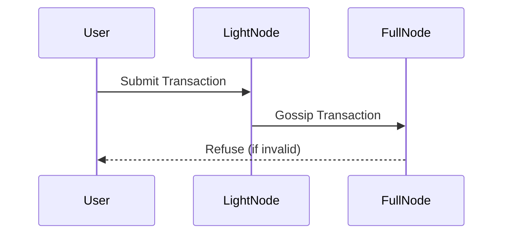
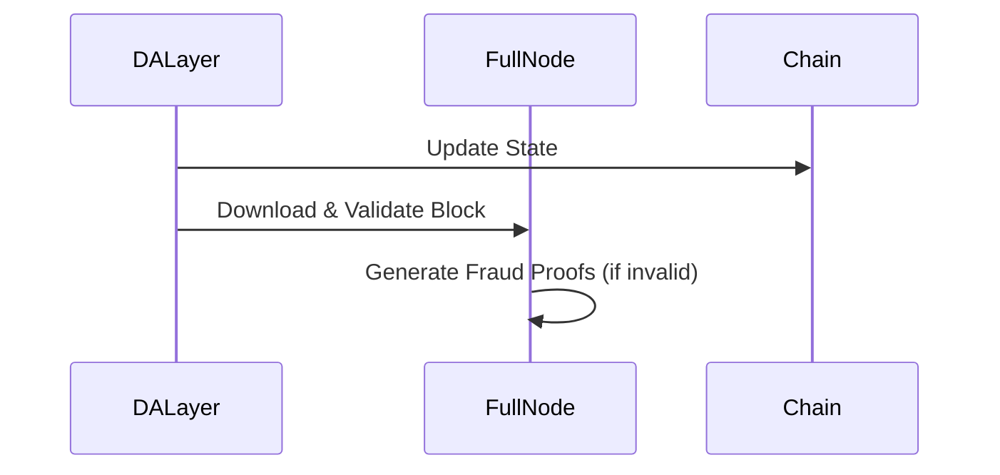
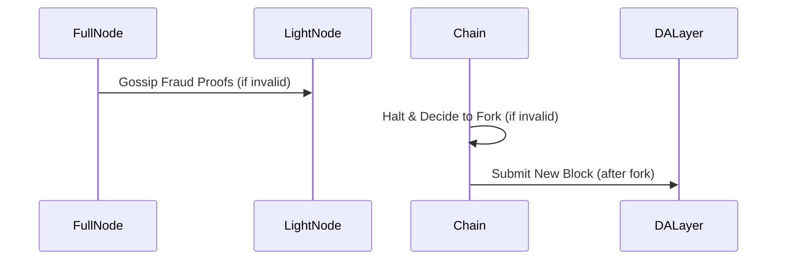

# Transaction flow

Users use a light node to communicate with the P2P network for two primary reasons:

- submitting transactions
- gossipping headers and fraud proofs

::: warning
Light nodes are still a work in progress.
:::

Here's what the typical transaction flow looks like:

## Transaction submission

## Transaction validation and processing

## Block processing

## Fraud proof gossip and forking

To transact, users submit a transaction to their light node, which gossips the transaction to a full node. Before adding the transaction to their mempool, the full node checks its validity. Valid transactions are included in the mempool, while invalid ones are refused, and the user's transaction will not be processed.

If the transaction is valid and has been included in the mempool, the sequencer can add it to a block, which is then submitted to the data availability (DA) layer. This results in a successful transaction flow for the user, and the state of the system is updated accordingly.

<!-- 
TODO: need to update design and docs
After the block is submitted to the DA layer, the full nodes download and validate the block.
However, there is a possibility that the sequencer may maliciously submit a block to the DA layer with invalid transactions or state. In such cases, the full nodes of the chain will consider the block invalid. In the case of an optimistic system, if they find the block invalid, they generate fraud proofs and gossip them in the P2P network among other full and light nodes.

As a result, the chain will halt, and the network will decide to fork the chain through social consensus. In the future, when a decentralized sequencer scheme is in place, additional options will be available, such as slashing the sequencer or selecting another full node as the sequencer. However, in any case, a new block must be created and submitted to the DA layer. You can read more about sequencer nodes [here](/learn/stack#sequencer-node). -->
