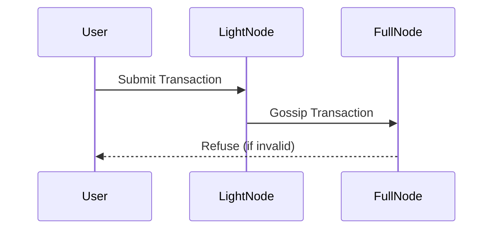
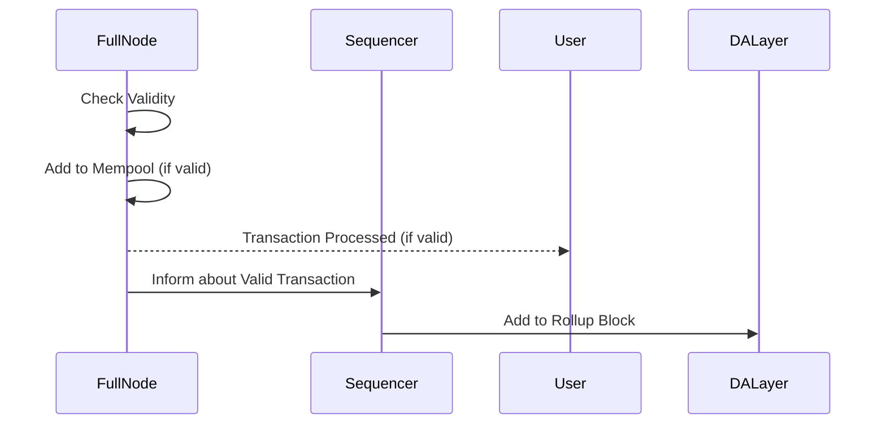
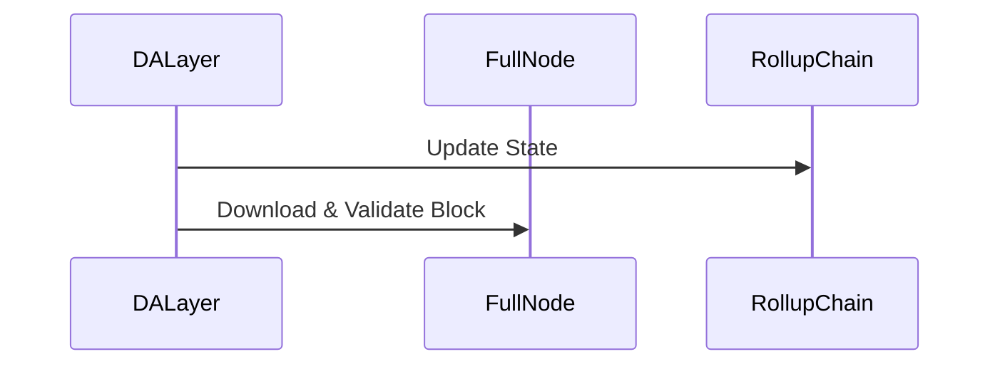

# Transaction flow

Rollup users use a light node to communicate with the rollup P2P network for two primary reasons:

- submitting transactions
- gossipping headers and fraud proofs

Here's what the typical transaction flow looks like:

## Transaction submission

## Transaction validation and processing

## Block processing

To transact, users submit a transaction to their light node, which gossips the transaction to a full node. Before adding the transaction to their mempool, the full node checks its validity. Valid transactions are included in the mempool, while invalid ones are refused, and the user's transaction will not be processed.

If the transaction is valid and has been included in the mempool, the sequencer can add it to a chain block, which is then submitted to the data availability (DA) layer. This results in a successful transaction flow for the user, and the state of the chain is updated accordingly.

After the block is submitted to the DA layer, the full nodes download and validate the block.
